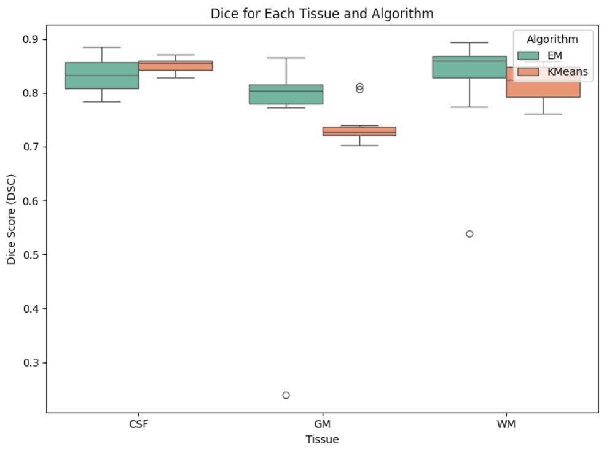
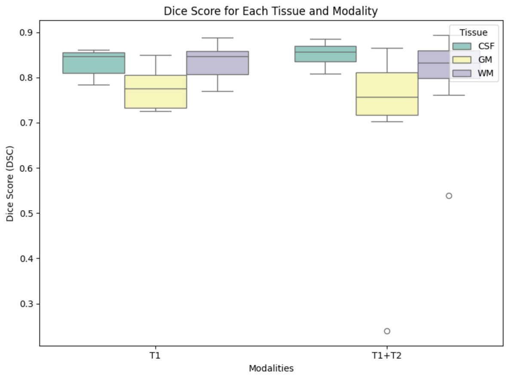
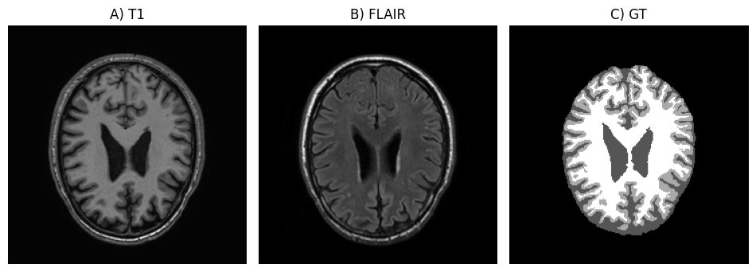

# Unsupervised Brain Tissue Segmentation with GMM and EM

This project implements an unsupervised brain tissue segmentation pipeline for MRI images using a combination of k-means clustering for initialization and the Expectation-Maximization (EM) algorithm. The pipeline segments brain tissues into **Grey Matter (GM)**, **White Matter (WM)**, and **Cerebrospinal Fluid (CSF)**. Segmentation performance is evaluated using Dice similarity scores.

## Overview

The segmentation pipeline includes the following steps:
1. **Preprocessing**: Intensity normalization of T1 and T2_FLAIR MRI scans to ensure consistent intensity ranges.
2. **Clustering and EM Algorithm**:
   - **KMeans Initialization**: Initializes cluster centers for GM, WM, and CSF.
   - **EM Algorithm**: Refines clusters and estimates parameters (mean, variance, mixing coefficients) of each tissue type based on voxel intensities.
   - **Cluster Sorting**: Assigns labels consistently across scans by sorting clusters by their mean intensities (1: CSF, 2: GM, 3: WM).
3. **Evaluation**: Dice similarity scores are used to evaluate segmentation accuracy by comparing the predicted labels to ground truth masks.

## Experimental Results

The following are the experimental findings from the segmentation pipeline:

### Dice Score Evaluation

Dice similarity scores were calculated to evaluate the segmentation accuracy for each tissue type. The scores varied across folders, with some notable observations:

- **Grey Matter (GM)**: Dice scores for GM segmentation were generally high across most folders, with Folder 5 achieving the highest score of 0.866. However, Folder 2 showed a significantly lower GM score (0.241), indicating segmentation challenges.
- **White Matter (WM)**: WM segmentation performed well, with scores ranging from 0.824 to 0.893 across Folders 1, 3, 4, and 5. Similar to GM, Folder 2 had a lower WM score (0.539).
- **Cerebrospinal Fluid (CSF)**: CSF segmentation showed high Dice scores, with Folder 5 achieving the best score of 0.885. Folder 2 had a slightly lower CSF score (0.805).



### Folder 2 Performance Analysis

Folder 2 exhibited significantly lower segmentation performance, with a mean Dice score of 0.528 and higher standard deviation (0.283). Upon visual inspection, it was observed that the T2_FLAIR image for Folder 2 contained a high-intensity lesion not visible in the T1 image, likely causing the EM algorithm to misclassify the lesion as WM. When the segmentation was run on T1 alone, the Dice scores improved significantly:
- **CSF**: 0.853
- **GM**: 0.802
- **WM**: 0.774

This suggests that the lesion in the T2_FLAIR image contributed to the lower segmentation accuracy.



## Results Summary

| Folder | Mean Dice (T1) | Std Dice (T1) | GM Dice (T1) | WM Dice (T1) | CSF Dice (T1) |
|--------|-----------------|---------------|--------------|--------------|---------------|
| 1      | 0.847          | 0.029         | 0.806        | 0.862        | 0.873         |
| 2      | 0.529          | 0.232         | 0.241        | 0.539        | 0.808         |
| 3      | 0.788          | 0.038         | 0.788        | 0.824        | 0.856         |
| 4      | 0.818          | 0.021         | 0.818        | 0.863        | 0.856         |
| 5      | 0.881          | 0.012         | 0.866        | 0.893        | 0.885         |



## Quantitative and Qualitative Analysis

- **Quantitative Results**: The T1 modality generally performed better in segmentation compared to T2_FLAIR, particularly for GM and WM.
- **Qualitative Observations**: The presence of lesions in T2_FLAIR images may confuse the clustering and segmentation process, as seen in Folder 2.

## Conclusion

The segmentation pipeline effectively segments brain tissues in MRI images, showing strong performance, particularly for WM and CSF. Future improvements may focus on handling lesions and other high-intensity artifacts in T2_FLAIR images to enhance accuracy further.

## Installation

Install the required packages with:

```bash
pip install -r requirements.txt
